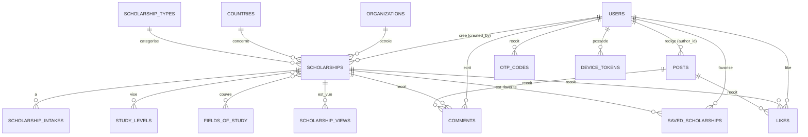

    <div align="center">

# 🎓 Bourse Pour Tous — Backend Laravel

### API pour l'appli mobile (Expo/React Native) et le back-office admin


</div>

---

## 📖 Sommaire

1. [Modélisation des données](#-modélisation-des-données)
2. [Diagramme des relations](#-diagramme-des-relations)
3. [Rôles & permissions](#-rôles--permissions)
4. [Arborescence complète du projet](#-arborescence-complète-du-projet)
5. [Commandes artisan — dans l'ordre](#-commandes-artisan--dans-lordre)
6. [Authentification OTP + reset password (Gmail)](#-authentification-otp--reset-password-gmail)
7. [Middleware](#-middleware)
8. [Routes API — appli publique](#-routes-api--appli-publique)
9. [Routes API — back-office admin](#-routes-api--back-office-admin)
10. [Seeders & données de démo](#-seeders--données-de-démo)

---

## 🗃️ Modélisation des données

La fiche-type d'une bourse (capture "Humber International Entrance") impose quelques choix de modélisation :
- une bourse peut viser **plusieurs niveaux d'études** à la fois (Bachelor + Post-graduate) → relation many-to-many
- une bourse peut avoir **plusieurs périodes de candidature** (rentrée sept. ET rentrée janvier) → table dédiée `scholarship_intakes`
- le financement est **partiel ou total** → enum `funding_type`
- les "informations complémentaires" sont une **liste de conseils**, pas un paragraphe unique → stockées en JSON

### Tables principales

| Table | Rôle | Champs clés |
|---|---|---|
| `users` | Comptes (admin, rédacteur, utilisateur) | `name`, `email`, `password`, `role`, `avatar`, `email_verified_at` |
| `otp_codes` | Codes OTP (login admin, reset password) | `user_id`, `code`, `type`, `expires_at`, `used_at` |
| `countries` | Pays (`countryName`, drapeau) | `name`, `code_iso2`, `flag_emoji` |
| `study_levels` | Niveaux d'étude | `name` (Licence, Master, Doctorat, Post-graduate...) |
| `scholarship_types` | Types de bourse | `name` (Excellence, Mobilité, Sportive, Recherche...) |
| `fields_of_study` | Filières | `name` (Informatique, Droit, "Toutes filières"...) |
| `organizations` | Organismes octroyant la bourse | `name`, `logo`, `website`, `description` |
| `scholarships` | **Bourse** — table centrale | voir détail ci-dessous |
| `scholarship_intakes` | Périodes de candidature (1 à N par bourse) | `scholarship_id`, `intake_label`, `period_start`, `period_end` |
| `scholarship_study_level` | Pivot bourse ↔ niveaux | `scholarship_id`, `study_level_id` |
| `scholarship_field_of_study` | Pivot bourse ↔ filières | `scholarship_id`, `field_of_study_id` |
| `posts` | Actualités | `title`, `slug`, `content`, `cover_image`, `author_id`, `published_at` |
| `partners` | Partenaires (cercles "stories") | `name`, `logo`, `website`, `is_featured` |
| `services` | Coaching / formation / préparation de dossier | `title`, `kind`, `description`, `price` |
| `products` | E-books, guides, documents | `title`, `category`, `price`, `file_url` |
| `comments` | Commentaires (polymorphes : post ou bourse) | `user_id`, `commentable_type`, `commentable_id`, `content`, `parent_id` |
| `likes` | Likes (polymorphes) | `user_id`, `likeable_type`, `likeable_id` |
| `saved_scholarships` | Bourses mises en favoris par un utilisateur | `user_id`, `scholarship_id` |
| `scholarship_views` | Log de consultation (sert aux stats par pays) | `scholarship_id`, `user_id`, `country_id`, `viewed_at` |
| `device_tokens` | Tokens push Expo | `user_id`, `expo_push_token`, `platform` |

### Détail de la table `scholarships`

| Champ | Type | Note |
|---|---|---|
| `id` | bigint | |
| `title` | string | Nom de la bourse |
| `slug` | string, unique | Généré depuis `title` |
| `organization_id` | FK → organizations | |
| `country_id` | FK → countries, nullable | `null` = bourse internationale/multi-pays |
| `scholarship_type_id` | FK → scholarship_types | |
| `funding_type` | enum(`partielle`,`totale`) | Cf. badge "Partiellement financée" |
| `objective` | text | Objectif |
| `conditions` | text | Conditions principales |
| `advantages` | text | Avantages |
| `additional_info` | json, nullable | Tableau de conseils/points ("Renouvellement", "Anglais requis"...) |
| `official_link` | string, nullable | Site officiel |
| `cover_image` | string, nullable | |
| `status` | enum(`brouillon`,`publié`,`archivé`) | Workflow rédacteur → publication |
| `is_featured` | boolean | Mise en avant sur l'accueil |
| `views_count` | unsignedInteger, default 0 | Compteur rapide (dénormalisé) |
| `created_by` | FK → users | Rédacteur/admin auteur |
| `timestamps`, `softDeletes` | | |

---

## 🔗 Diagramme des relations



---

## 👥 Rôles & permissions

Colonne `role` (enum) sur `users` : `admin`, `redacteur`, `user`.

| Rôle | Peut faire |
|---|---|
| **Admin** | Tout : CRUD complet, gestion des utilisateurs, stats, configuration, publication/dépublication |
| **Rédacteur** | CRUD sur Bourses, Posts, Services, Produits, Partenaires — **sans** gestion des utilisateurs ni des stats globales |
| **Utilisateur (front)** | Consultation, like, commentaire, favoris, inscription/connexion |

> Pour aller plus loin (permissions fines par action), le package `spatie/laravel-permission` peut remplacer l'enum `role` par des rôles/permissions dynamiques — non nécessaire au démarrage.

---

## 🌳 Arborescence complète du projet

```
bourse-backend/
├── app/
│   ├── Console/
│   │   └── Commands/
│   │       └── PruneExpiredOtpCodes.php        # tâche planifiée : purge des OTP expirés
│   ├── Http/
│   │   ├── Controllers/
│   │   │   ├── Api/
│   │   │   │   ├── Auth/
│   │   │   │   │   ├── RegisterController.php
│   │   │   │   │   ├── LoginController.php
│   │   │   │   │   ├── OtpController.php        # génération + vérification OTP
│   │   │   │   │   ├── PasswordResetController.php
│   │   │   │   │   └── LogoutController.php
│   │   │   │   ├── Public/
│   │   │   │   │   ├── ScholarshipController.php
│   │   │   │   │   ├── PostController.php
│   │   │   │   │   ├── PartnerController.php
│   │   │   │   │   ├── ServiceController.php
│   │   │   │   │   ├── ProductController.php
│   │   │   │   │   ├── CommentController.php
│   │   │   │   │   ├── LikeController.php
│   │   │   │   │   ├── SavedScholarshipController.php
│   │   │   │   │   ├── SearchController.php      # recherche + filtres
│   │   │   │   │   └── ProfileController.php
│   │   │   │   └── Admin/
│   │   │   │       ├── DashboardController.php   # stats globales
│   │   │   │       ├── ScholarshipController.php
│   │   │   │       ├── StudyLevelController.php
│   │   │   │       ├── ScholarshipTypeController.php
│   │   │   │       ├── FieldOfStudyController.php
│   │   │   │       ├── CountryController.php
│   │   │   │       ├── OrganizationController.php
│   │   │   │       ├── PostController.php
│   │   │   │       ├── PartnerController.php
│   │   │   │       ├── ServiceController.php
│   │   │   │       ├── ProductController.php
│   │   │   │       ├── UserController.php
│   │   │   │       └── StatsController.php       # stats par pays / filière
│   │   │   └── Controller.php
│   │   ├── Middleware/
│   │   │   ├── EnsureUserHasRole.php
│   │   │   ├── EnsureEmailIsVerifiedApi.php
│   │   │   └── ThrottleOtpRequests.php
│   │   ├── Requests/
│   │   │   ├── Scholarship/
│   │   │   │   ├── StoreScholarshipRequest.php
│   │   │   │   └── UpdateScholarshipRequest.php
│   │   │   ├── Post/
│   │   │   │   ├── StorePostRequest.php
│   │   │   │   └── UpdatePostRequest.php
│   │   │   ├── Auth/
│   │   │   │   ├── RegisterRequest.php
│   │   │   │   ├── LoginRequest.php
│   │   │   │   ├── VerifyOtpRequest.php
│   │   │   │   └── ResetPasswordRequest.php
│   │   │   └── ...                                # un StoreX/UpdateX par entité CRUD
│   │   └── Resources/
│   │       ├── ScholarshipResource.php
│   │       ├── ScholarshipDetailResource.php
│   │       ├── PostResource.php
│   │       ├── PartnerResource.php
│   │       ├── ServiceResource.php
│   │       ├── ProductResource.php
│   │       ├── CommentResource.php
│   │       └── UserResource.php
│   ├── Mail/
│   │   ├── OtpMail.php                            # code OTP (login / reset password)
│   │   └── WelcomeMail.php
│   ├── Models/
│   │   ├── User.php
│   │   ├── OtpCode.php
│   │   ├── Country.php
│   │   ├── StudyLevel.php
│   │   ├── ScholarshipType.php
│   │   ├── FieldOfStudy.php
│   │   ├── Organization.php
│   │   ├── Scholarship.php
│   │   ├── ScholarshipIntake.php
│   │   ├── ScholarshipView.php
│   │   ├── Post.php
│   │   ├── Partner.php
│   │   ├── Service.php
│   │   ├── Product.php
│   │   ├── Comment.php
│   │   ├── Like.php
│   │   ├── SavedScholarship.php
│   │   └── DeviceToken.php
│   ├── Policies/
│   │   ├── ScholarshipPolicy.php
│   │   ├── PostPolicy.php
│   │   ├── ServicePolicy.php
│   │   └── ProductPolicy.php
│   ├── Services/
│   │   ├── OtpService.php                         # logique génération/validation OTP
│   │   ├── ScholarshipStatsService.php            # agrégation stats par pays
│   │   └── ExpoPushService.php                    # envoi notifications push Expo
│   └── Providers/
│       └── AppServiceProvider.php
├── bootstrap/
├── config/
│   ├── mail.php
│   ├── sanctum.php
│   └── cors.php
├── database/
│   ├── factories/
│   │   ├── UserFactory.php
│   │   ├── ScholarshipFactory.php
│   │   ├── PostFactory.php
│   │   ├── PartnerFactory.php
│   │   ├── ServiceFactory.php
│   │   └── ProductFactory.php
│   ├── migrations/
│   │   ├── 2026_08_01_000001_create_countries_table.php
│   │   ├── 2026_08_01_000002_create_study_levels_table.php
│   │   ├── 2026_08_01_000003_create_scholarship_types_table.php
│   │   ├── 2026_08_01_000004_create_fields_of_study_table.php
│   │   ├── 2026_08_01_000005_create_organizations_table.php
│   │   ├── 2026_08_01_000006_add_role_and_avatar_to_users_table.php
│   │   ├── 2026_08_01_000007_create_otp_codes_table.php
│   │   ├── 2026_08_01_000008_create_scholarships_table.php
│   │   ├── 2026_08_01_000009_create_scholarship_intakes_table.php
│   │   ├── 2026_08_01_000010_create_scholarship_study_level_table.php
│   │   ├── 2026_08_01_000011_create_scholarship_field_of_study_table.php
│   │   ├── 2026_08_01_000012_create_scholarship_views_table.php
│   │   ├── 2026_08_01_000013_create_posts_table.php
│   │   ├── 2026_08_01_000014_create_partners_table.php
│   │   ├── 2026_08_01_000015_create_services_table.php
│   │   ├── 2026_08_01_000016_create_products_table.php
│   │   ├── 2026_08_01_000017_create_comments_table.php
│   │   ├── 2026_08_01_000018_create_likes_table.php
│   │   ├── 2026_08_01_000019_create_saved_scholarships_table.php
│   │   └── 2026_08_01_000020_create_device_tokens_table.php
│   └── seeders/
│       ├── DatabaseSeeder.php
│       ├── CountrySeeder.php
│       ├── StudyLevelSeeder.php
│       ├── ScholarshipTypeSeeder.php
│       ├── FieldOfStudySeeder.php
│       ├── AdminUserSeeder.php
│       └── DemoScholarshipSeeder.php
├── routes/
│   ├── api.php              # inclut public.php et admin.php
│   ├── public.php            # routes de l'appli mobile
│   ├── admin.php             # routes back-office
│   └── console.php
├── resources/
│   └── views/
│       └── mail/
│           ├── otp-code.blade.php
│           └── welcome.blade.php
├── storage/
│   └── app/public/
│       ├── scholarships/
│       ├── posts/
│       ├── partners/
│       └── products/
├── .env.example
└── README.md
```

---

## ⚙️ Commandes artisan — dans l'ordre

### 1. Installation du projet

```bash
composer create-project laravel/laravel bourse-backend
cd bourse-backend
composer require laravel/sanctum
php artisan install:api        # publie la config Sanctum + routes/api.php
```

### 2. Modèles + migrations (générés ensemble avec `-m`)

```bash
php artisan make:model Country -m
php artisan make:model StudyLevel -m
php artisan make:model ScholarshipType -m
php artisan make:model FieldOfStudy -m
php artisan make:model Organization -m
php artisan make:model OtpCode -m
php artisan make:model Scholarship -mf              # -f génère aussi la factory
php artisan make:model ScholarshipIntake -m
php artisan make:model ScholarshipView -m
php artisan make:model Post -mf
php artisan make:model Partner -mf
php artisan make:model Service -mf
php artisan make:model Product -mf
php artisan make:model Comment -m
php artisan make:model Like -m
php artisan make:model SavedScholarship -m
php artisan make:model DeviceToken -m
```

### 3. Migration d'ajout de colonnes sur `users`

```bash
php artisan make:migration add_role_and_avatar_to_users_table --table=users
```

### 4. Tables pivot (many-to-many)

```bash
php artisan make:migration create_scholarship_study_level_table
php artisan make:migration create_scholarship_field_of_study_table
```

### 5. Contrôleurs — Admin (back-office, CRUD complet)

```bash

```

### 6. Contrôleurs — Public (appli mobile)

```bash

```

### 7. Authentification

```bash
php artisan make:controller Api/Auth/RegisterController
php artisan make:controller Api/Auth/LoginController
php artisan make:controller Api/Auth/OtpController
php artisan make:controller Api/Auth/PasswordResetController
php artisan make:controller Api/Auth/LogoutController
```


php artisan make:policy ScholarshipPolicy --model=Scholarship
php artisan make:policy PostPolicy --model=Post
php artisan make:policy ServicePolicy --model=Service
php artisan make:policy ProductPolicy --model=Product


### 12. Finalisation

```bash
php artisan storage:link
php artisan migrate
php artisan db:seed
```

---

## 🔐 Authentification OTP + reset password (Gmail)

### Config Gmail dans `.env`

```env

```

> Le mot de passe d'application se génère depuis le compte Google (validation en 2 étapes activée requise) → *Sécurité → Mots de passe des applications*. Ne jamais utiliser le mot de passe Gmail principal.

### Migration `otp_codes`

```php
// database/migrations/2026_08_01_000007_create_otp_codes_table.php
Schema::create('otp_codes', function (Blueprint $table) {
    $table->id();
    $table->foreignId('user_id')->constrained()->cascadeOnDelete();
    $table->string('code', 6);
    $table->enum('type', ['login', 'password_reset', 'email_verification']);
    $table->timestamp('expires_at');
    $table->timestamp('used_at')->nullable();
    $table->timestamps();
});
```

### `app/Services/OtpService.php`

```php
<?php

namespace App\Services;

use App\Mail\OtpMail;
use App\Models\OtpCode;
use App\Models\User;
use Illuminate\Support\Facades\Mail;

class OtpService
{
    public function generate(User $user, string $type): OtpCode
    {
        // Invalide les anciens codes du même type non utilisés
        $user->otpCodes()->where('type', $type)->whereNull('used_at')->delete();

        $otp = $user->otpCodes()->create([
            'code' => str_pad((string) random_int(0, 999999), 6, '0', STR_PAD_LEFT),
            'type' => $type,
            'expires_at' => now()->addMinutes(10),
        ]);

        Mail::to($user->email)->send(new OtpMail($otp->code, $type));

        return $otp;
    }

    public function verify(User $user, string $code, string $type): bool
    {
        $otp = $user->otpCodes()
            ->where('type', $type)
            ->where('code', $code)
            ->whereNull('used_at')
            ->where('expires_at', '>', now())
            ->latest()
            ->first();

        if (! $otp) {
            return false;
        }

        $otp->update(['used_at' => now()]);

        return true;
    }
}
```

### `app/Mail/OtpMail.php`

```php
<?php

namespace App\Mail;

use Illuminate\Bus\Queueable;
use Illuminate\Mail\Mailable;
use Illuminate\Queue\SerializesModels;

class OtpMail extends Mailable
{
    use Queueable, SerializesModels;

    public function __construct(
        public string $code,
        public string $type
    ) {}

    public function build()
    {
        $subject = match ($this->type) {
            'login' => 'Votre code de connexion — Bourse Pour Tous',
            'password_reset' => 'Réinitialisation de mot de passe — Bourse Pour Tous',
            default => 'Votre code de vérification — Bourse Pour Tous',
        };

        return $this->subject($subject)
            ->markdown('mail.otp-code')
            ->with(['code' => $this->code]);
    }
}
```

### `app/Http/Controllers/Api/Auth/OtpController.php` (extrait)

```php
public function requestLoginOtp(LoginRequest $request, OtpService $otpService)
{
    $user = User::where('email', $request->email)->firstOrFail();

    abort_unless(Hash::check($request->password, $user->password), 422, 'Identifiants invalides.');
    abort_unless(in_array($user->role, ['admin', 'redacteur']), 403, 'Réservé à l\'équipe éditoriale.');

    $otpService->generate($user, 'login');

    return response()->json(['message' => 'Code envoyé par email.']);
}

public function verifyLoginOtp(VerifyOtpRequest $request, OtpService $otpService)
{
    $user = User::where('email', $request->email)->firstOrFail();

    abort_unless($otpService->verify($user, $request->code, 'login'), 422, 'Code invalide ou expiré.');

    $token = $user->createToken('admin-session')->plainTextToken;

    return response()->json(['token' => $token, 'user' => $user]);
}
```

### Réinitialisation de mot de passe (par OTP, pas par lien)

```php
public function requestReset(Request $request, OtpService $otpService)
{
    $request->validate(['email' => 'required|email|exists:users,email']);
    $user = User::where('email', $request->email)->firstOrFail();

    $otpService->generate($user, 'password_reset');

    return response()->json(['message' => 'Code de réinitialisation envoyé.']);
}

public function resetPassword(ResetPasswordRequest $request, OtpService $otpService)
{
    $user = User::where('email', $request->email)->firstOrFail();

    abort_unless(
        $otpService->verify($user, $request->code, 'password_reset'),
        422,
        'Code invalide ou expiré.'
    );

    $user->update(['password' => Hash::make($request->password)]);
    $user->tokens()->delete(); // déconnecte toutes les sessions actives

    return response()->json(['message' => 'Mot de passe mis à jour.']);
}
```

---

## 🛡️ Middleware

### `app/Http/Middleware/EnsureUserHasRole.php`

```php
<?php

namespace App\Http\Middleware;

use Closure;
use Illuminate\Http\Request;

class EnsureUserHasRole
{
    public function handle(Request $request, Closure $next, string ...$roles)
    {
        abort_unless(
            $request->user() && in_array($request->user()->role, $roles),
            403,
            'Accès non autorisé.'
        );

        return $next($request);
    }
}
```

Enregistrement dans `bootstrap/app.php` (Laravel 11) :

```php
->withMiddleware(function (Middleware $middleware) {
    $middleware->alias([
        'role' => \App\Http\Middleware\EnsureUserHasRole::class,
        'otp.throttle' => \App\Http\Middleware\ThrottleOtpRequests::class,
    ]);
})
```

Usage dans les routes : `->middleware('role:admin,redacteur')`.

---

## 🌍 Routes API — appli publique

`routes/public.php` (inclus dans `routes/api.php` avec le préfixe `v1`) :

```php
// --- Authentification (utilisateur lambda) ---
Route::post('/register', [RegisterController::class, 'store']);
Route::post('/login', [LoginController::class, 'store']);
Route::post('/logout', [LogoutController::class, 'destroy'])->middleware('auth:sanctum');

// --- Mot de passe oublié (OTP) ---
Route::post('/password/request-reset', [PasswordResetController::class, 'requestReset']);
Route::post('/password/reset', [PasswordResetController::class, 'resetPassword']);

// --- Bourses ---
Route::get('/scholarships', [ScholarshipController::class, 'index']);
Route::get('/scholarships/{scholarship:slug}', [ScholarshipController::class, 'show']);
Route::get('/scholarships/featured', [ScholarshipController::class, 'featured']);

// --- Recherche & filtres ---
Route::get('/search', [SearchController::class, 'index']); // ?q=&country=&level=&field=

// --- Référentiels (pour peupler les filtres côté appli) ---
Route::get('/countries', [CountryController::class, 'index']);
Route::get('/study-levels', [StudyLevelController::class, 'index']);
Route::get('/scholarship-types', [ScholarshipTypeController::class, 'index']);
Route::get('/fields-of-study', [FieldOfStudyController::class, 'index']);

// --- Posts (actualités) ---
Route::get('/posts', [PostController::class, 'index']);
Route::get('/posts/{post:slug}', [PostController::class, 'show']);

// --- Partenaires ---
Route::get('/partners', [PartnerController::class, 'index']);

// --- Services & produits ---
Route::get('/services', [ServiceController::class, 'index']);
Route::get('/products', [ProductController::class, 'index']);
Route::get('/products/{product}', [ProductController::class, 'show']);

// --- Interactions (nécessitent une connexion) ---
Route::middleware('auth:sanctum')->group(function () {
    Route::post('/comments', [CommentController::class, 'store']);
    Route::delete('/comments/{comment}', [CommentController::class, 'destroy']);

    Route::post('/likes', [LikeController::class, 'toggle']); // {likeable_type, likeable_id}

    Route::get('/me/saved-scholarships', [SavedScholarshipController::class, 'index']);
    Route::post('/me/saved-scholarships/{scholarship}', [SavedScholarshipController::class, 'store']);
    Route::delete('/me/saved-scholarships/{scholarship}', [SavedScholarshipController::class, 'destroy']);

    Route::get('/me/profile', [ProfileController::class, 'show']);
    Route::put('/me/profile', [ProfileController::class, 'update']);

    Route::post('/me/device-token', [ProfileController::class, 'storeDeviceToken']);
});
```

---

## 🖥️ Routes API — back-office admin

`routes/admin.php`, préfixe `/api/v1/admin`, protégé par `auth:sanctum` + `role:admin,redacteur` (sauf mention contraire) :

```php
Route::middleware(['auth:sanctum', 'role:admin,redacteur'])->group(function () {

    // --- Dashboard & stats ---
    Route::get('/dashboard', [DashboardController::class, 'index']);
    Route::get('/stats/by-country', [StatsController::class, 'byCountry']);
    Route::get('/stats/by-field', [StatsController::class, 'byField']);

    // --- Bourses (CRUD complet) ---
    Route::apiResource('scholarships', ScholarshipController::class);
    Route::patch('/scholarships/{scholarship}/publish', [ScholarshipController::class, 'publish']);
    Route::patch('/scholarships/{scholarship}/archive', [ScholarshipController::class, 'archive']);

    // --- Référentiels (Niveaux, Types, Filières, Pays, Organismes) ---
    Route::apiResource('study-levels', StudyLevelController::class);
    Route::apiResource('scholarship-types', ScholarshipTypeController::class);
    Route::apiResource('fields-of-study', FieldOfStudyController::class);
    Route::apiResource('countries', CountryController::class);
    Route::apiResource('organizations', OrganizationController::class);

    // --- Contenu ---
    Route::apiResource('posts', PostController::class);
    Route::apiResource('partners', PartnerController::class);
    Route::apiResource('services', ServiceController::class);
    Route::apiResource('products', ProductController::class);

    // --- Utilisateurs (admin uniquement) ---
    Route::middleware('role:admin')->group(function () {
        Route::apiResource('users', UserController::class)->except(['store']);
        Route::patch('/users/{user}/role', [UserController::class, 'updateRole']);
    });
});

// --- Auth back-office (OTP obligatoire pour admin/rédacteur) ---
Route::prefix('admin')->group(function () {
    Route::post('/login', [OtpController::class, 'requestLoginOtp']);
    Route::post('/login/verify', [OtpController::class, 'verifyLoginOtp']);
});
```

`Route::apiResource()` génère automatiquement les 5 routes CRUD (`index`, `store`, `show`, `update`, `destroy`) pour chaque contrôleur — pas besoin de les écrire à la main.

---

## 🌱 Seeders & données de démo

```bash
# CountrySeeder → Canada, France, Royaume-Uni, Allemagne, Côte d'Ivoire...
# StudyLevelSeeder → Licence, Master, Doctorat, Post-graduate
# ScholarshipTypeSeeder → Excellence, Mobilité, Recherche, Coopération
# FieldOfStudySeeder → Informatique, Droit, Économie, Ingénierie, "Toutes filières"
# AdminUserSeeder → 1 compte admin + 1 compte rédacteur de test
# DemoScholarshipSeeder → 5-10 bourses réalistes (basées sur la capture Humber)

php artisan db:seed
```

# bourse-back

